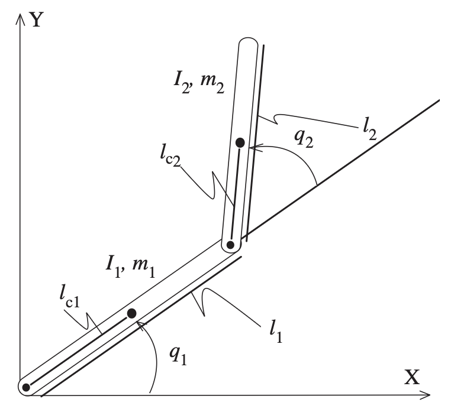
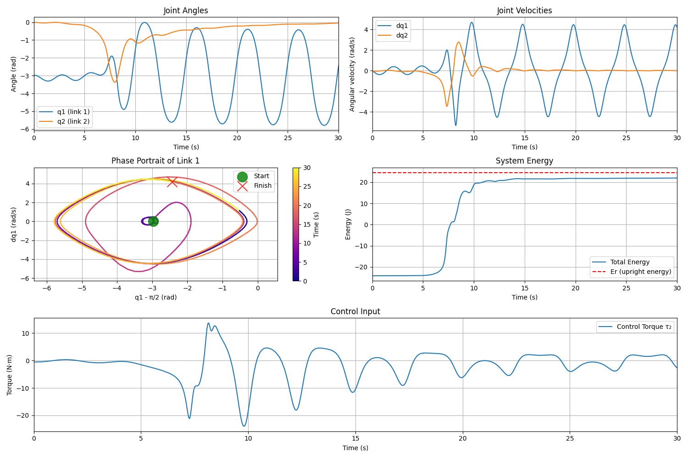
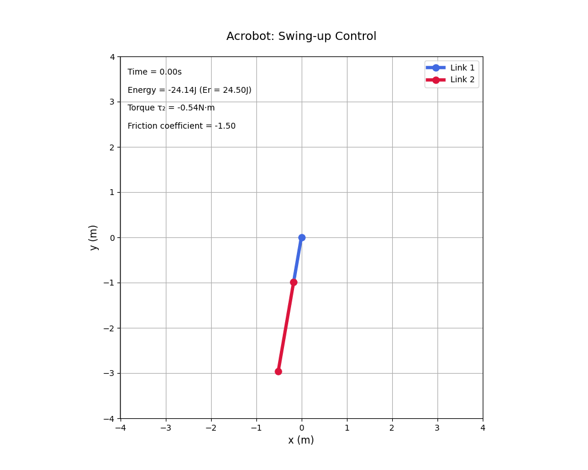
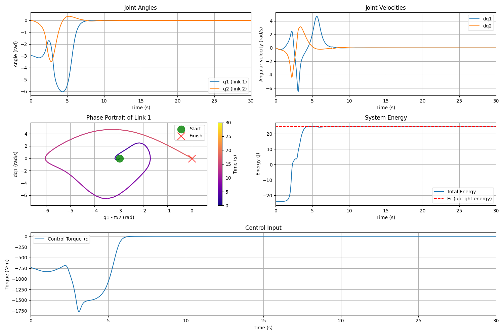
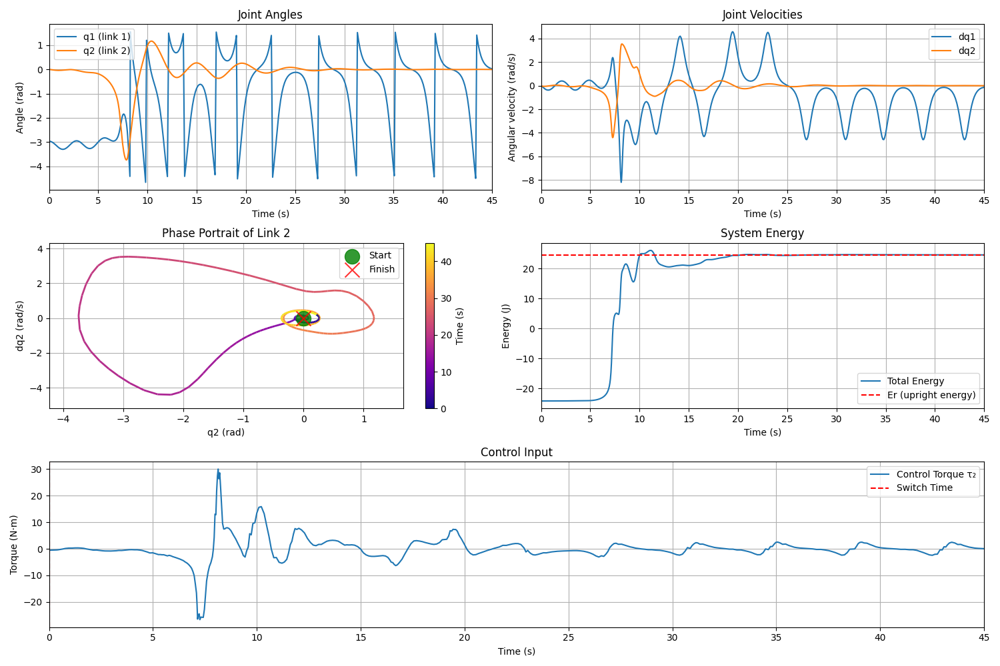
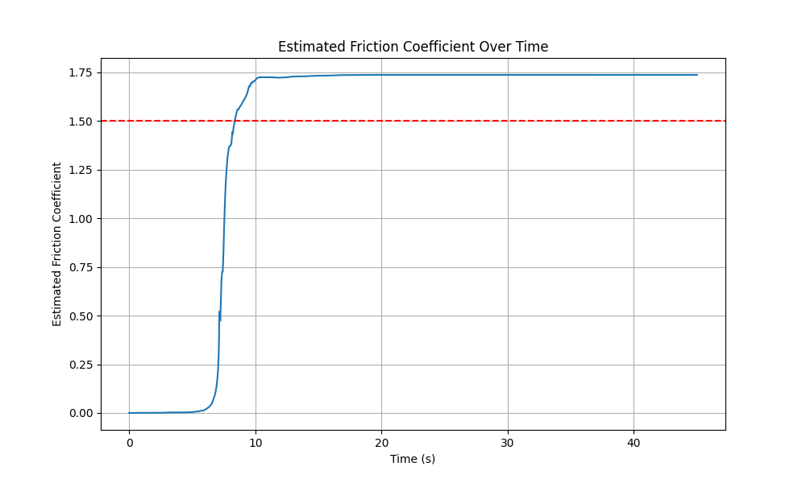
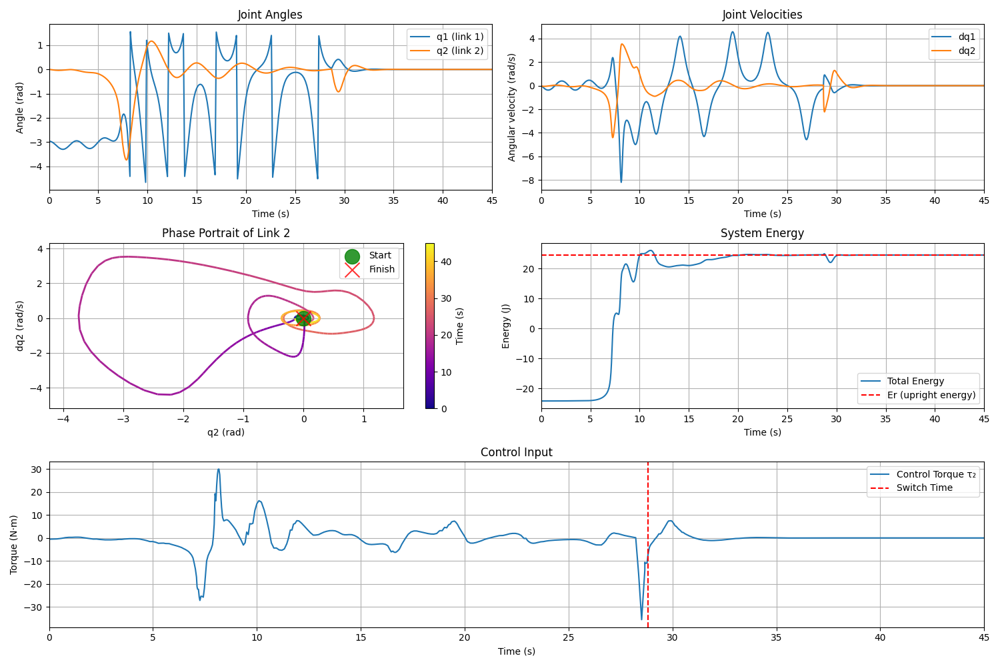
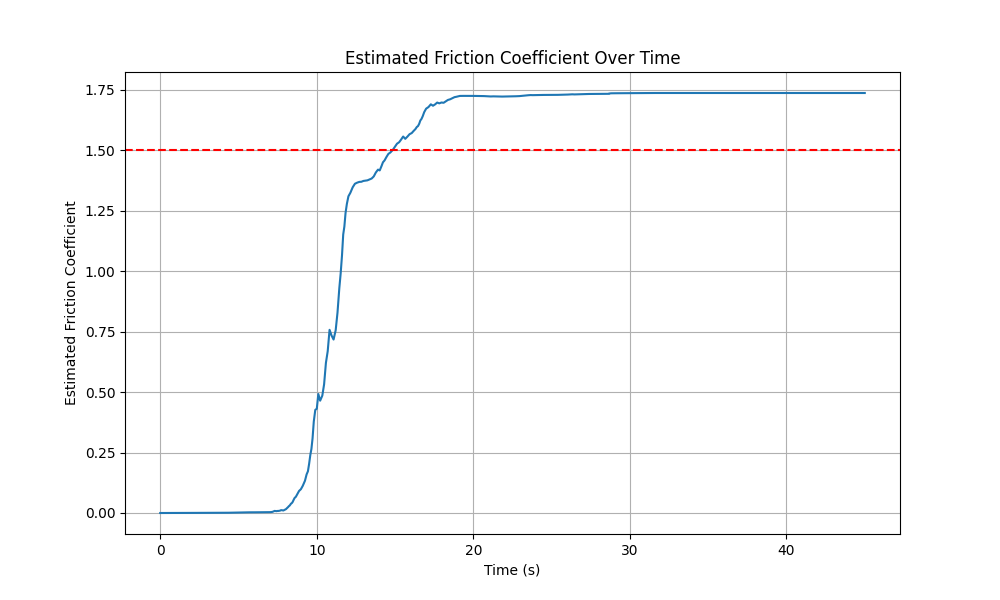

# Acrobot Control System

This repository implements an energy-based controller for the Acrobot, a classic underactuated robotic system. The Acrobot consists of two links connected linearly, with only the second joint actuated, presenting a challenging control problem.

<p align="center">
  
</p>
<p align="center">
  <em>Full stabilization of the Acrobot system using an adaptive controller with PD control transition at the apex</em>
</p>

## 📋 Overview

The Acrobot system consists of two links connected in a chain, with one end fixed. Only the joint between the two links is actuated. The challenge is to swing up the Acrobot from its initial downward hanging position to an upright balanced position using only the torque applied at the middle joint. In this scenario, viscous friction in the second joint is also introduced.

**Control Strategy:**
1. **Adaptive Control**: Initially swings up the Acrobot by regulating its total energy with adaptation term
2. **PD Control**: Takes over near the upright position for stabilization

## 🚀 Quick Start

### Prerequisites

If you don't have [uv](https://github.com/astral-sh/uv) (a fast Python package installer and resolver) installed, run:

```bash
curl -LsSf https://astral.sh/uv/install.sh | sh
```

### Running the Simulation

To run the standard simulation with full stabilization:

```bash
uv run acrobot.py
```

The plots and animation will be saved to `gfx/adaptive_control/`.

To run the simulation with only the energy-based controller (without switching to PD control):

```bash
uv run acrobot.py --adaptive-only
```

This alternative simulation output will be saved to `gfx/energy_based_only/`.

## 🧠 Technical Background

### Acrobot Dynamics

<p align="center">
  
</p>
<p align="center">
  <em>A two-link planar robot</em>
</p>

The motion equation of the Acrobot is:

```math
M(q)\ddot{q} + C(q, \dot{q})\dot{q} + G(q) + \begin{bmatrix}
0 \\
b_2 \dot{q}_2
\end{bmatrix}
 = \tau
```

Where:
- $q = [q_1, q_2]^T$ , where $q_1, q_2$ represents joint angles and $\dot{q}_1, \dot{q}_2$ represent their angular velocities accordingly 
- $\tau = [0, \tau_2]^T$ represents torques (with $\tau_1 = 0$ since the first joint is unactuated, $\tau_2$ is a control action)
- $M(q)$ is the inertia matrix
- $C(q, \dot{q})$ contains Coriolis and centrifugal terms
- $G(q)$ represents gravitational terms
- $b_2$ is a viscous friction coefficient in the second joint

#### Inertia Matrix $M(q)$
The inertia matrix $M(q)$ represents the mass distribution of the robotic system as a function of its configuration $q$. It maps joint accelerations to the corresponding inertial forces and torques. For the Acrobot, it's a 2×2 symmetric, positive-definite matrix where each element $M_{ij}$ represents the coupling inertia between joints $i$ and $j$. When a joint accelerates, the inertia matrix determines how much torque is required at each joint to produce that acceleration.

```math
M(q) = \begin{bmatrix} 
M_{11} & M_{12} \\ 
M_{21} & M_{22} 
\end{bmatrix} = \begin{bmatrix} 
\alpha_1 + \alpha_2 + 2\alpha_3 \cos q_2 & \alpha_2 + \alpha_3 \cos q_2 \\ 
\alpha_2 + \alpha_3 \cos q_2 & \alpha_2 
\end{bmatrix}
```

#### Coriolis and Centrifugal Terms $C(q, \dot{q})$
The term $C(q, \dot{q})\dot{q}$ captures the velocity-dependent forces in the system. Specifically:
- **Coriolis forces**: Arise when a body moves in a rotating reference frame, causing an apparent force perpendicular to both the direction of motion and the axis of rotation.
- **Centrifugal forces**: Outward forces that appear when an object moves in a curved path, directed away from the center of rotation.

```math
C(q, \dot{q})\dot{q} = \begin{bmatrix} 
H_1 \\ 
H_2 
\end{bmatrix} = \alpha_3 \begin{bmatrix} 
-2\dot{q}_1 \dot{q}_2 - \dot{q}_2^2 \\ 
\dot{q}_1^2 
\end{bmatrix} \sin q_2
```

These terms depend on both joint positions $q$ and velocities $\dot{q}$, and they become significant at higher speeds, affecting the dynamics of multi-link systems like the Acrobot.

#### Gravitational Terms $G(q)$
The vector $G(q)$ represents the effect of gravity on the system as a function of its configuration $q$. Each element $G_i$ corresponds to the torque exerted by gravity at joint $i$. For the Acrobot, these terms depend on the angles of the links relative to the gravitational field and determine how the system behaves when no control input is applied. The gravitational terms are particularly important in underactuated systems like the Acrobot, as they can be exploited for control purposes.

```math
G(q) = \begin{bmatrix} 
G_1 \\ 
G_2 
\end{bmatrix} = \begin{bmatrix} 
\beta_1 \cos q_1 + \beta_2 \cos(q_1 + q_2) \\ 
\beta_2 \cos(q_1 + q_2) 
\end{bmatrix}
```

### Control Strategy in Detail

#### 1. Energy-Based Swing-Up Control

The adaptive controller works by:
- Calculating the total energy of the system
- Comparing it to the target energy at the upright position
- Integrating $\hat b_2$ equation
- Applying torque to regulate the energy to the target value according to adaptive term

The Lyapunov function candidate used is:

```math
V = \frac{1}{2} (E - E_r)^2 + \frac{1}{2} k_D \dot{q}_2^2 + \frac{1}{2} k_P q_2^2 + \frac{(\hat b_2 - b_2)^2}{2\gamma}
```

Where:
- $E$ is the current system energy
- $E_r$ is the energy at the upright equilibrium
- $k_D$, $k_P$ are positive constants
- $\gamma$ is adaptation coefficient

#### System Energy $E$
The system energy $E$ represents the total mechanical energy of the Acrobot system, which is the sum of kinetic and potential energy. The kinetic energy accounts for the motion of both links, including rotational effects, while the potential energy relates to the height of the center of mass of each link in the gravitational field. This total energy is a key quantity in the energy-based control approach, as it provides a scalar measure that captures the overall state of the system.

```math
E(q, \dot{q}) = \frac{1}{2} \dot{q}^T M(q) \dot{q} + P(q)
```

#### Upright Equilibrium Energy $E_r$
The upright equilibrium energy $E_r$ represents the potential energy of the Acrobot when it is perfectly balanced in the inverted position with both links aligned vertically upward and stationary. This is the target energy level that the energy-based controller aims to achieve. By regulating the system's total energy to match $E_r$, the controller can bring the Acrobot to the vicinity of the upright equilibrium position, even though the system is underactuated.

```math
E_r = E(q, \dot{q}) \big|_{q_1 = \pi/2, \, q_2 = 0, \, \dot{q} = 0} = \beta_1 + \beta_2
```

#### Derivation of the Control Law

The control law is derived using Lyapunov's direct method, which involves constructing a positive definite function and then finding conditions to make its time derivative negative semi-definite.

1. First, we define a Lyapunov function candidate:

```math
V = \frac{1}{2} (E - E_r)^2 + \frac{1}{2} k_D \dot{q}_2^2 + \frac{1}{2} k_P q_2^2 + \frac{(\hat b_2 - b_2)^2}{2\gamma}
```

2. We differentiate this function with respect to time to get $\dot{V}$:

```math
\dot{V} = (E - E_r)\dot{E} + k_D \dot{q}_2 \ddot{q}_2 + k_P q_2 \dot{q}_2 + \frac{\dot{\hat b_2} - b_2}{\gamma} \dot{\hat{b_2}}
```

3. Since $\dot{E} = \dot{q}^T \tau = \dot{q}_2 \tau_2 - \hat b_2 \dot q_2^2$ (as $\tau_1 = 0$), we have:

```math
\dot{V} = \dot{q}_2 \left( (E - E_r) (\tau_2 - \hat{b_2}\dot{q_2}) + k_D \ddot{q}_2 + k_P q_2 \right) + (\hat b - b_2)(\dot{q_2^2}(E-E_r)+ \frac{\dot{\hat b}}{\gamma})
```

4. Let $\hat{\dot b} = -\gamma \dot q_2^2(E-E_r)$, then $\hat b(t) = \int_0^t{-\gamma \dot q_2^2(E-E_r)dt}$

5. To ensure $\dot{V} \leq 0$, we set:

```math
(E - E_r) (\tau_2 - \hat{b_2}\dot{q_2}) + k_D \ddot{q}_2 + k_P q_2 = -k_V \dot{q}_2
```

Where $k_V > 0$ is a damping coefficient.

6. Solving for $\tau_2$ using the system dynamics equations leads to the final control law:

```math
\tau_2 = -\frac{(k_V \dot{q}_2 + k_P q_2)\Delta + k_D[M_{21}(H_1 + G_1) - M_{11}(H_2 + G_2 + \hat b_2\dot q_2)]}{k_D M_{11} + (E - E_r)\Delta}
```

Where:
- $k_V$, $k_P$, and $k_D$ are positive control gains
- $\dot{q}_2$ is the angular velocity of the second joint
- $q_2$ is the angle of the second joint
- $\Delta = \det(M(q)) = M_{11}M_{22} - M_{12}M_{21}$ is the determinant of the inertia matrix
- $M_{ij}$ are elements of the inertia matrix $M(q)$
- $H_1$ and $H_2$ are the Coriolis and centrifugal terms
- $G_1$ and $G_2$ are the gravitational terms
- $E$ is the current system energy
- $E_r$ is the target energy at the upright equilibrium

For the complete mathematical derivation with all steps and proofs, see the [detailed derivation document](https://github.com/antonbolychev/wasserschwein-acrobot/blob/adaptive_control/README-derivation-adaptive.md).


#### 2. Linear PD Control for Stabilization

Once the system is near the upright position, a linear PD controller takes over:

```math
\tau_2 = -F \cdot x
```

Where:
- $x = [q_1 - \pi/2, q_2, \dot{q}_1, \dot{q}_2]^T$ is the state error vector
- $F$ is the feedback gain matrix

## 📊 Experiments Definition

### Energy based control with viscous friction

We introduced viscous friction in the second joint with energy based control without adaptation.

<p align="center">
  
  
</p>
<p align="center">
  <em>Acrobot using only energy-based controller (with PD stabilization) with friction in second joint</em>
</p>

As you can see on the image Acrobot cannot reach desired position.

Friction coefficient used in the experiments: $\gamma=1.5$.

### Energy based control with viscous friction and compensation

To validate the friction implementation using the control law described above, we can modify our control law:

```math
\tau_2 = -\frac{(k_V \dot{q}_2 + k_P q_2)\Delta + k_D[M_{21}(H_1 + G_1) - M_{11}(H_2 + G_2)]}{k_D M_{11} + (E - E_r)\Delta} + b_2 \dot q_2
```
<p align="center">
  
  
</p>
<p align="center">
  <em>Acrobot using energy-based controller (with PD stabilization) with friction in second joint and compensation in control law</em>
</p>

As you can see the plant behaviour is like without friction with energy based control.

## 📊 Results and Discussion

### What Works Well

The implemented controller demonstrates effective performance:

1. **Successful Swing-up**: The energy-based controller successfully swings the Acrobot from the downward position toward the upright position
2. **Smooth Energy Regulation**: Energy gradually converges to the target value
3. **Effective Switching Strategy**: The transition between energy-based and PD controllers happens seamlessly
4. **Adaptive term convergence**: The adaptive term convergence to a stable number

<p align="center">
  
  
  
</p>
<p align="center">
  <em>Acrobot using adaptive controller (without PD stabilization) with friction in second joint</em>
</p>

<p align="center">
  
  
  
</p>
<p align="center">
  <em>Acrobot using adaptive controller (with PD stabilization) with friction in second joint</em>
</p>

### Current Limitations

The current implementation has several limitations:

1. **Non-Stationary Balancing**: As shown in the animations, the controller does not achieve perfectly stationary balancing at the upright position. The system exhibits small oscillations around the equilibrium point.

2. **Parameter Sensitivity**: The controller performance is sensitive to the tuning parameters ($k_D$, $k_P$, $k_V$, $\gamma$) and may require re-tuning for different Acrobot parameters.

### Potential Improvements

Several improvements could be made to enhance the controller performance:

1. **Stationary Balancing**: The controller can be modified to achieve truly stationary balancing by:
   - Fine-tuning the PD controller gains

2. **Optimal Control Parameters**: Using optimization techniques to find optimal control parameters rather than manual tuning

### Comparative Analysis

The full stabilization approach (adaptive control + PD) clearly outperforms the adaptive control only approach, as seen in the animations and plots. While the adaptive controller can bring the Acrobot close to the upright position, it cannot maintain stability there without the PD controller.

#### Adaptive controller only
<p align="center">
  
  
  
</p>
<p align="center">
  <em>Acrobot using adaptive controller (without PD stabilization) with friction in second joint</em>
</p>

#### Full stabilization
<p align="center">
  
  
  
</p>
<p align="center">
  <em>Acrobot using adaptive controller (with PD stabilization) with friction in second joint</em>
</p>

## 👨‍💻 Code Structure

The implementation is contained in a single file (`acrobot.py`) with the following key components:

* [**Acrobot Class**](https://github.com/antonbolychev/acm2025-wasserschwein-acrobot/blob/d6ca88ff417ecafb20038cae29a3820ae6b99311/acrobot.py#L14): Defines the system dynamics and control methods
* [**Simulation Function**](https://github.com/antonbolychev/acm2025-wasserschwein-acrobot/blob/d6ca88ff417ecafb20038cae29a3820ae6b99311/acrobot.py#L161C9-L161C17): Integrates the equations of motion using `solve_ivp` via RK4 scheme
* [**Controller**](https://github.com/antonbolychev/acm2025-wasserschwein-acrobot/blob/d6ca88ff417ecafb20038cae29a3820ae6b99311/acrobot.py#L128): Enable PD controller for Acrobot stabilization
* [**Visualization Functions**](https://github.com/antonbolychev/acm2025-wasserschwein-acrobot/blob/d6ca88ff417ecafb20038cae29a3820ae6b99311/acrobot.py#L272): Generates plots and animations
* [**Command-Line Interface**](https://github.com/antonbolychev/acm2025-wasserschwein-acrobot/blob/d6ca88ff417ecafb20038cae29a3820ae6b99311/acrobot.py#L357): Uses `tyro` for argument parsing

## 🔍 Mathematical Details

For a deeper understanding of the mathematical derivations, please refer to the [README-derivation-energy-based.md](https://github.com/antonbolychev/wasserschwein-acrobot/blob/adaptive_control/README-derivation-adaptive.md), which includes:

- Detailed derivation of the adaptive control law
- Stability analysis using Lyapunov theory
- Solvability conditions
- Controller switching strategy

## 🙏 Authors
* [Egor Miroshnichenko](https://github.com/Chenkomirosh)
* [Anton Bolychev](https://github.com/antonbolychev)
* [Vladislav Sarmatin](https://github.com/VladSarm)
* [Arsenii Shavrin](https://github.com/ArseniiSh)

## 📚 References
* [Sutton, R. S. (1996). Generalization in Reinforcement Learning: Successful Examples Using Sparse Coarse Coding.](https://proceedings.neurips.cc/paper/1995/file/8f1d43620bc6bb580df6e80b0dc05c48-Paper.pdf)
* Xin, Xin & Kaneda, M. (2007). Analysis of the energy‐based swing‐up control of the Acrobot. International Journal of Robust and Nonlinear Control, 17, 1503-1524.
