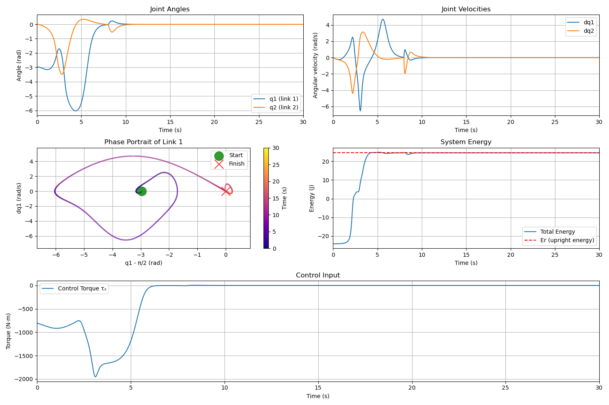
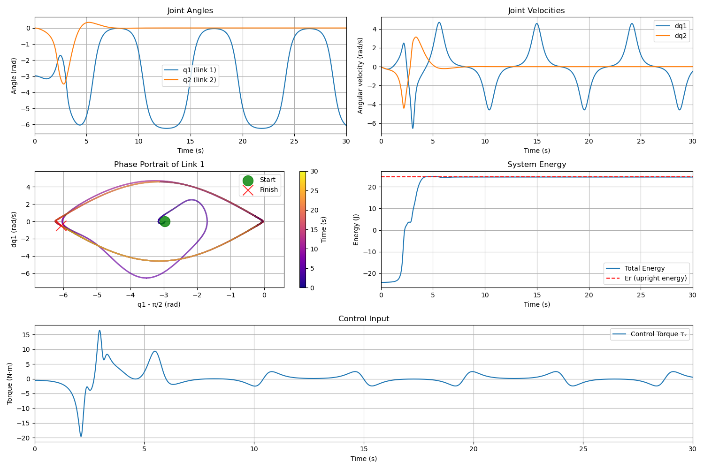

# Acrobot Control System

This repository implements an energy-based controller for the Acrobot, a classic underactuated robotic system. The Acrobot consists of two links connected linearly, with only the second joint actuated, presenting a challenging control problem.

<p align="center">
  
</p>
<p align="center">
  <em>Full stabilization of the Acrobot system using an energy-based controller with PD control transition at the apex</em>
</p>

## 📋 Overview

The Acrobot system consists of two links connected in a chain, with one end fixed. Only the joint between the two links is actuated. The challenge is to swing up the Acrobot from its initial downward hanging position to an upright balanced position using only the torque applied at the middle joint.

**Control Strategy:**
1. **Energy-Based Control**: Initially swings up the Acrobot by regulating its total energy
2. **PD Control**: Takes over near the upright position for stabilization

## 🚀 Quick Start

### Prerequisites

If you don't have [uv](https://github.com/astral-sh/uv) (a fast Python package installer and resolver) installed, run:

```bash
curl -LsSf https://astral.sh/uv/install.sh | sh
```

### Running the Simulation

To run the standard simulation with full stabilization:

```bash
uv run acrobot.py
```

The plots and animation will be saved to `gfx/full_stabilization/`.

To run the simulation with only the energy-based controller (without switching to PD control):

```bash
uv run acrobot.py --energy-based-only
```

This alternative simulation output will be saved to `gfx/energy_based_only/`.

## 🧠 Technical Background

### Acrobot Dynamics

<p align="center">
  
</p>
<p align="center">
  <em>A two-link planar robot</em>
</p>

The motion equation of the Acrobot is:

```math
M(q)\ddot{q} + C(q, \dot{q})\dot{q} + G(q) = \tau
```

Where:
- $q = [q_1, q_2]^T$ , where $q_1, q_2$ represents joint angles and $\dot{q_1}, \dot{q_2} represent their angular velocities accordingly$ 
- $\tau = [0, \tau_2]^T$ represents torques (with $\tau_1 = 0$ since the first joint is unactuated, $\tau_2$ is a control action)
- $M(q)$ is the inertia matrix
- $C(q, \dot{q})$ contains Coriolis and centrifugal terms
- $G(q)$ represents gravitational terms

### Control Strategy in Detail

#### 1. Energy-Based Swing-Up Control

The energy-based controller works by:
- Calculating the total energy of the system
- Comparing it to the target energy at the upright position
- Applying torque to regulate the energy to the target value

The Lyapunov function candidate used is:

```math
V = \frac{1}{2} (E - E_r)^2 + \frac{1}{2} k_D \dot{q}_2^2 + \frac{1}{2} k_P q_2^2
```

Where:
- $E$ is the current system energy
- $E_r$ is the energy at the upright equilibrium
- $k_D$, $k_P$ are positive constants

The derived control law is:

```math
\tau_2 = -\frac{(k_V \dot{q}_2 + k_P q_2)\Delta + k_D[M_{21}(H_1 + G_1) - M_{11}(H_2 + G_2)]}{k_D M_{11} + (E - E_r)\Delta}
```

#### 2. Linear PD Control for Stabilization

Once the system is near the upright position, a linear PD controller takes over:

```math
\tau_2 = -F \cdot x
```

Where:
- $x = [q_1 - \pi/2, q_2, \dot{q}_1, \dot{q}_2]^T$ is the state error vector
- $F$ is the feedback gain matrix

## 📊 Results and Discussion

### What Works Well

The implemented controller demonstrates effective performance:

1. **Successful Swing-up**: The energy-based controller successfully swings the Acrobot from the downward position toward the upright position
2. **Smooth Energy Regulation**: Energy gradually converges to the target value
3. **Effective Switching Strategy**: The transition between energy-based and PD controllers happens seamlessly

### Current Limitations

The current implementation has several limitations:

1. **Non-Stationary Balancing**: As shown in the animations, the controller does not achieve perfectly stationary balancing at the upright position. The system exhibits small oscillations around the equilibrium point.

2. **Parameter Sensitivity**: The controller performance is sensitive to the tuning parameters ($k_D$, $k_P$, $k_V$) and may require re-tuning for different Acrobot parameters.

### Potential Improvements

Several improvements could be made to enhance the controller performance:

1. **Stationary Balancing**: The controller can be modified to achieve truly stationary balancing by:
   - Fine-tuning the PD controller gains

2. **Optimal Control Parameters**: Using optimization techniques to find optimal control parameters rather than manual tuning

### Comparative Analysis

The full stabilization approach (energy-based + PD) clearly outperforms the energy-based only approach, as seen in the animations and plots. While the energy-based controller can bring the Acrobot close to the upright position, it cannot maintain stability there without the PD controller.

<p align="center">
  
  <br>
  <em>Full stabilization controller performance</em>
</p>

<p align="center">
  
</p>
<p align="center">
  <em>Full stabilization of the Acrobot system using an energy-based controller with PD control transition at the apex</em>
</p>

<p align="center">
  
  <br>
  <em>Energy-based only controller performance</em>
</p>

<p align="center">
  
</p>
<p align="center">
  <em>Acrobot using only energy-based controller (without PD stabilization)</em>
</p>

## 👨‍💻 Code Structure

The implementation is contained in a single file (`acrobot.py`) with the following key components:

* [**Acrobot Class**](https://github.com/antonbolychev/acm2025-wasserschwein-acrobot/blob/d6ca88ff417ecafb20038cae29a3820ae6b99311/acrobot.py#L14): Defines the system dynamics and control methods
* [**Simulation Function**](https://github.com/antonbolychev/acm2025-wasserschwein-acrobot/blob/d6ca88ff417ecafb20038cae29a3820ae6b99311/acrobot.py#L161C9-L161C17): Integrates the equations of motion using `solve_ivp`
* [**Controller**](https://github.com/antonbolychev/acm2025-wasserschwein-acrobot/blob/d6ca88ff417ecafb20038cae29a3820ae6b99311/acrobot.py#L128): Enable PD controller for Acrobot stabilization
* [**Visualization Functions**](https://github.com/antonbolychev/acm2025-wasserschwein-acrobot/blob/d6ca88ff417ecafb20038cae29a3820ae6b99311/acrobot.py#L272): Generates plots and animations
* [**Command-Line Interface**](https://github.com/antonbolychev/acm2025-wasserschwein-acrobot/blob/d6ca88ff417ecafb20038cae29a3820ae6b99311/acrobot.py#L357): Uses `tyro` for argument parsing

## 🔍 Mathematical Details

For a deeper understanding of the mathematical derivations, please refer to the [derivation document](derivation-doc.md), which includes:

- Detailed derivation of the energy-based control law
- Stability analysis using Lyapunov theory
- Solvability conditions
- Controller switching strategy

## 🙏 Authors
* [Egor Miroshnichenko](https://github.com/Chenkomirosh)
* [Anton Bolychev](https://github.com/antonbolychev)
* [Vladislav Sarmatin](https://github.com/VladSarm)
* [Arsenii Shavrin](https://github.com/ArseniiSh)

## 📚 References
* [Sutton, R. S. (1996). Generalization in Reinforcement Learning: Successful Examples Using Sparse Coarse Coding.](https://proceedings.neurips.cc/paper/1995/file/8f1d43620bc6bb580df6e80b0dc05c48-Paper.pdf)
* Xin, Xin & Kaneda, M. (2007). Analysis of the energy‐based swing‐up control of the Acrobot. International Journal of Robust and Nonlinear Control, 17, 1503-1524.
